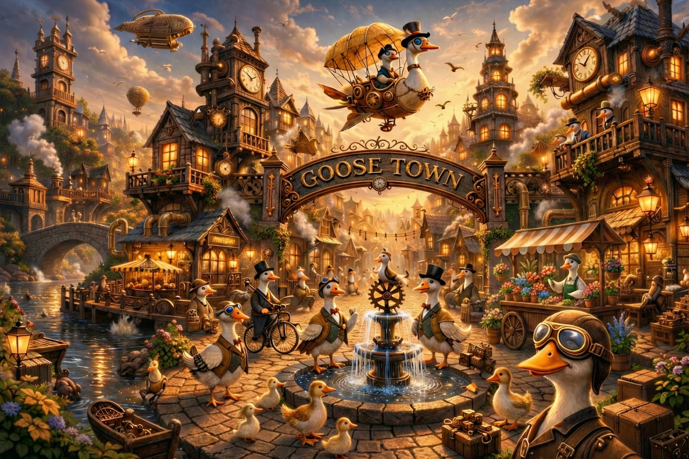

# Welcome to Goosetown!

<p align="center">
  
</p>

<p align="center"><em>A tiny town that ships.</em></p>

<p align="center">
  <a href="#quick-start">Quick Start</a> · <a href="#how-it-works">How It Works</a> · <a href="AGENTS.md">AGENTS.md</a>
</p>

<p align="center">
  <a href="https://github.com/block/goosetown/actions/workflows/test.yml"></a>
  <a href="LICENSE"></a>
  <a href="https://discord.gg/goose-oss"></a>
</p>

Goosetown coordinates flocks of AI agents — researchers, writers, workers, reviewers — so you describe what to build and the town builds it. Research-first, parallel by default, with crossfire reviews across multiple models.

## Quick Start

1. **Install [goose](https://github.com/block/goose/releases)** (v1.25.0+)
2. **Clone and enter Goosetown**
   ```bash
   git clone https://github.com/block/goosetown.git
   cd goosetown
   ```
3. **Start goose** (the wrapper enables telepathy — orchestrator → delegate push messages)
   ```bash
   ./goose
   ```

Say hello — goose already knows its way around town.

> [!NOTE]
> On first run, goose may ask you to set a few environment variables. Follow its instructions and restart.

## See It Work

Here's what coordination looks like on the Town Wall:

```
[16:21:41] <orchestrator>       Spawning research flock...
[16:22:06] <researcher-local>   💡 Found existing patterns in GUIDES/
[16:22:19] <researcher-github>  🎬 Scanning issues and PRs
[16:23:46] <orchestrator>       Research complete. Dispatching workers...
[16:24:11] <worker-auth>        🎬 Claiming src/auth/mod.rs
[16:25:02] <reviewer-gpt5>     ✅ APPROVE (9/10)
```

- The **orchestrator** spawns a research flock to understand the problem
- **Delegates** broadcast progress on gtwall so siblings avoid duplicate work
- The orchestrator synthesizes findings, dispatches workers, then runs crossfire review

## How It Works

The orchestrator decomposes your request into phases — research, build, review — and dispatches parallel delegates called *flocks* that coordinate through the Town Wall.

```
        Orchestrator
            │ spawns
     ┌──────┼──────┐
     ▼      ▼      ▼
 Researchers (flock)      ← share findings via gtwall
            │ synthesize
     ┌──────┼──────┐
     ▼      ▼      ▼
 Workers + Writers        ← parallel execution
            │ review
     ┌──────┼──────┐
     ▼      ▼      ▼
 Reviewers (crossfire)    ← multi-model adversarial QA
            │
     Final deliverable
```

When three or more delegates share a task and coordinate via gtwall, that's a *flock*.

## Core Concepts

- **Orchestrator** — the main session; decomposes work, dispatches delegates, synthesizes results
- **Delegates** — parallel subagents: researchers, writers, workers, reviewers
- **Skills** — role definitions loaded into each delegate at spawn
- **gtwall** — the Town Wall; broadcast channel for real-time delegate coordination
- **Telepathy** — orchestrator → delegate push messages for urgent paging

There's a real-time dashboard for watching your flock work (yes, they're actual geese on a map) — just ask goose to launch it.

Learn more in [AGENTS.md](AGENTS.md).

---

Part of the [goose](https://github.com/block/goose) ecosystem by [Block](https://block.xyz).

[Apache 2.0 License](LICENSE)
